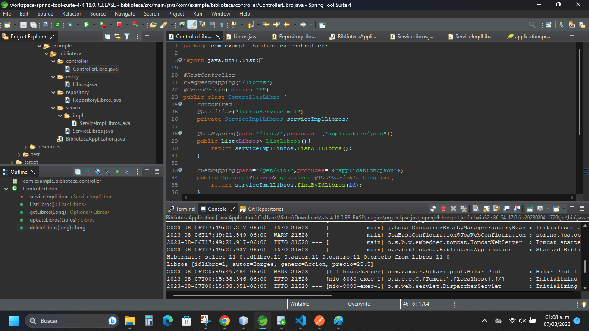

# Biblioteca probado en sistema windows 11

# API REST SPRING BOOT para una libreria

## Caracteristicas de este proyecto y modelos de bases de datos

## modelos

```json
class Libros {
        "idlibro": 1,
        "autor": "Borges",
        "genero": "Accion",
        "precio": "25.5"
}

```

## Como usar este proyecto 
> Tener instalado JDK versión 8


### Instalar ORACLE SQL versión 21C
### Descargar SQL developer
### Ambientar la base de datos con los siguientes scripts en el mismo orden que aparecen 

```Script 1 crear usuario de bd (funciona ya que no se agrego archivo de tipo .env)

alter SESSION set "_ORACLE_SCRIPT" = TRUE;
CREATE USER LIB IDENTIFIED BY "lib";
GRANT "CONNECT" TO "LIB";
GRANT "RESOURCE" TO "LIB";
GRANT UNLIMITED TABLESPACE TO "LIB";
ALTER USER "LIB" ACCOUNT UNLOCK;
COMMIT;
```
### Posterior al primer script se crea una conexión nueva con el user y pwd que vienen el en archivo properties
```Config conexion oracle 
Nombre del Host: localhost
Puerto: 1521
SID: xe
```
### Ya iniciada la nueva conexión creada se ejecuta el script 2
```Script 2 Crea tabla libros para la base de datos librería y realiza un insert de prueba 

create table libros(
idlibro NUMBER(20,0) GENERATED BY DEFAULT AS IDENTITY MINVALUE 1 MAXVALUE 9999999999999999999999999999 INCREMENT BY 1 START WITH 1 CACHE 20 NOORDER NOCYCLE NOT NULL ENABLE,
autor varchar2(20),
genero varchar(30),
precio number(6,2)
);

INSERT INTO libros(autor, genero, precio) values ('Borges','Accion','25.50');
COMMIT;
```

### Una vez creada la base de datos ya podemos utilizar los endpoint configurados en esta aplicación

## Se recomienda uso de software para probar APIS como postman. En cuestión del IDE puede ser de eclipse o Intellij.

### Paso 1 Levantar el servidor Tomcat ejecutando la API en Spring boot y acceder al enlace
```
  path: http://localhost:8080
```
### La respuesta esperada al levantar el servicio es la siguiente en el navegador 


### Paso 2 Comenzar a probar los endpoint, los path presentados se deberan ingresar a postman para realizar las pruebas pertinentes

```
path: hhttp://localhost:8080/libros/list/
```

## respuesta del servidor esperada
```json
    {
        "idlibro": 1,
        "autor": "Borges",
        "genero": "Accion",
        "precio": "25.5"
    }
```

## Apartir de este paso ya se puede utilizar el resto de los endpoints

### paths para la actualizacion
```plaintext
   GET por id:http://localhost:8080/libros/list/?1
   PUT : http://localhost:8080/libros/update/  mas el body en postman
   GET ALL : http://localhost:8080/libros/list/
   DELETE: http://localhost:8080/libros/delete/21
```

## Prueba de la API ejecurandose 
